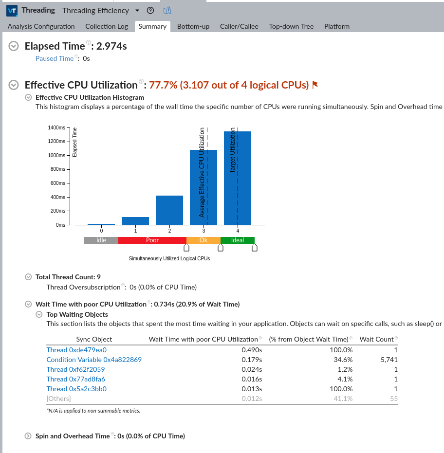

## 2d_data_operations

This example serves as a profiling baseline. It is a "compute-intensive" program where 4 stages operate on `vector<vector<T>>` or 2D data:

1. Generate random 2D of size 255x255
2. Apply normalization
3. Apply a stencil like modification
4. Attach a sink stage, that simply burns CPU cycles and makes sure the operation is not discarded

The choice of 4 stages is made because my puny system will only provide 4 CPUs. Higher utilization can be achieved by attaching more stages, but causing over-subscription will only skew the result of the analysis; the goal is to evaluate at the limit of what the hardware provides. The __Intel VTune profiler__ was used to conduct the following analyses:

## 1. Threading



### High points

* CPU utilization 77.7%
* Most of the time all logical cores are used
* Spin and overhead time is 0

### Low points

* Wait time has 20% poor CPU utilization
* Condition variable wait is 34.6% of the total wait time

There is also one interesting aspect shown in the full report. There's < 10 instances of waiting to acquire a lock (in contrast condition variable wait is in effect ~5k times) and total time spent on mutex acquisition is ~1ms in a 3s run (so it's responsible for ~ 0.03%). Due to the inherent "situation" of subsequent stages waiting for the result of previous stages, locking for the duration of a swap is nowhere near important. Hence replacing the queue with a lock-free or doubly buffered queue would offer little benefit.

This leads us to two possible improvements:

1. Implement work stealing or other load balancing design, to avoid static assignment of 1 thread to 1 stage.
2. Add cooperative multi-threading to the mix to simplify task allocation.

## 2. Hotspots

The report has been truncated to show the names of the culprits without name mangling:

```
Top Hotspots
------------------------------------------------------------------
Function                       Module                     CPU Time
------------------------------------------------------------------
MatModifier  ::_M_invoke      two_dimensional_transform    2.790s
MatNormalizer::_M_invoke      two_dimensional_transform    2.130s
MatCoefWriter::_M_invoke      two_dimensional_transform    2.038s
MatGenerator ::_M_invoke      two_dimensional_transform    0.642s
mersenne_twister_engine
  ::_M_gen_rand               two_dimensional_transform    0.528s
[Others]                      N/A                          0.902s
```
The framework does not need any significant overhead to provide the threading and resource management.
